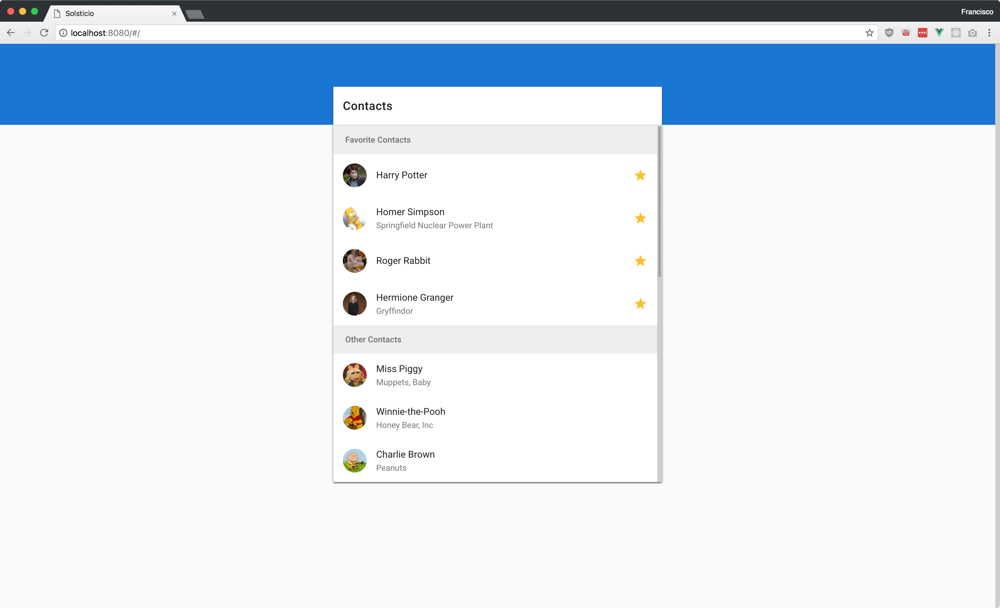

# Solsticio



Small project for Solstice's programming challenge to assess skill level and problem-solving.

**Note**: There was a CORS issue that I kept encountering. It seems that the following `https://s3.amazonaws.com/technical-challenge/v3/contacts.json` S3 bucket doesn't have CORS enabled. So the `contacts.json` is included under `static/`

### Features
- [Vue.js](https://vuejs.org/) as the frontend framework.
- [Vuex](https://vuex.vuejs.org/en/) for state management
- [Vue-Router](https://router.vuejs.org/en/) for component routing.
- [Vuetify](https://vuetifyjs.com/) for Material components.
- ES2017 syntax.
- Linting with [ESLint](http://eslint.org/).
- Conforms to [Airbnb's JavaScript Style Guide](https://github.com/airbnb/javascript).

## Build Setup

``` bash
# install dependencies
npm install

# serve with hot reload at localhost:8080
npm run dev

# build for production with minification
npm run build

# build for production and view the bundle analyzer report
npm run build --report
```

This project was bootstrapped with [vue-cli](https://github.com/vuejs/vue-cli).
